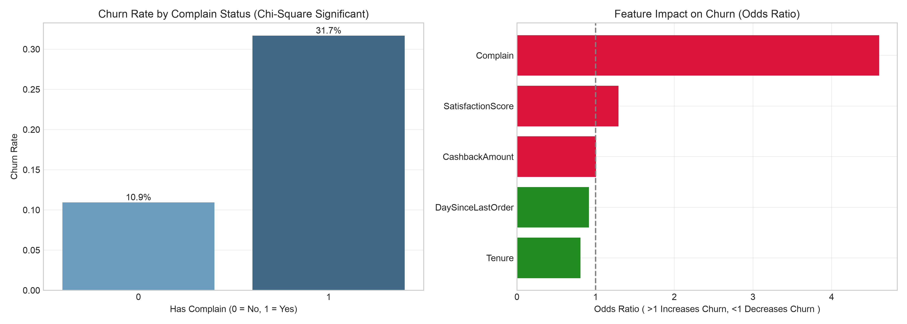

# E-Commerce Customer Churn Analysis & Risk Modeling

## 📌 Business Overview
Customer churn is a critical KPI for e-commerce platforms. This project aims to identify key drivers behind customer churn, validate business hypotheses using inferential statistics, and quantify feature impact via Logistic Regression Odds Ratios to inform targeted retention strategies.

---

## 🛠️ Tech Stack & Methodology
- **Database & Processing**: MySQL, DataGrip (Data cleaning, aggregation)
- **Statistical Modeling**: Python, `scipy.stats`, `statsmodels`, `pandas`, `seaborn`
- **Analytical Framework**:
  1. Hypothesis Testing ($\chi^2$ Test, Mann-Whitney U Test)
  2. Econometric Interpretation (Logistic Regression Odds Ratios)

---

## 📊 Key Statistical Findings & Insights

### 1. Customer Complaints are the Primary Risk Factor ($\chi^2$ Test)
- **Hypothesis**: Customer complaint status is independent of customer churn.
- **Result**: $\chi^2 = 350.93, p < 0.001$. Reject $H_0$.
- **Business Insight**: Customer complaints have a statistically significant relationship with churn. Improving post-sales resolution workflows is crucial.

### 2. Coupon Discount Strategy Inefficiency (Mann-Whitney U Test)
- **Hypothesis**: Churned customers use significantly fewer coupons than active customers.
- **Result**: $U = 2038042.5, p = 0.2674 > 0.05$. Fail to reject $H_0$.
- **Business Insight**: No statistically significant difference in coupon usage between churned (1.72) and retained (1.76) customers. Blanket discount strategies do not prevent churn; budget should be reallocated to personalized retention.

### 3. Quantifying Marginal Effects (Logistic Regression Odds Ratio)
Controling for other covariates:
- **Complain Status ($\text{OR} = 4.60$)**: Customers with complaints are **4.6 times more likely** (360% increase in odds) to churn compared to non-complainants.
- **Tenure ($\text{OR} = 0.81$)**: Each additional month of platform tenure decreases the odds of churn by **19.2%**.

---

## 🚀 Actionable Recommendations
1. **Prioritize Service Quality**: Establish an instant-response system for customer complaints to mitigate the 4.6x churn risk.
2. **Shift Discount Policy**: Replace generic coupon distribution with tenure-based loyalty rewards to leverage the tenure protective effect.
